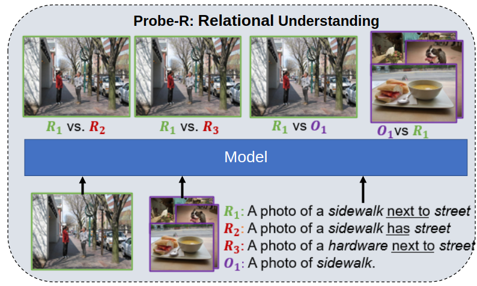

# Probing Conceptual Understanding of Large Visual-Language Models
We present a novel framework for probing and improving relational, compositional and contextual understanding of large 
visual-language models (V+L). While large V+L models have achieved success in various downstream tasks, it is not clear 
if they have a conceptual grasp of the content. We propose a novel benchmarking dataset for probing three aspects of 
content understanding. Our probes are grounded in cognitive science and help determine if a V+L model can, for example, 
determine if snow garnished with a man is implausible, or if it can identify beach furniture by knowing it is located on
a beach. We have experimented with 5 well known models, such as CLIP and ViLT, and found that they mostly fail to 
demonstrate a conceptual understanding. That said, we find interesting insights such as cross-attention helps learning 
conceptual understanding. We use these insights to propose a new finetuning technique that rewards the three conceptual 
understanding measures we proposed. We hope that the presented benchmarks will help the community assess and improve the 
conceptual understanding capabilities of large V+L models.


## Installation
Requires:
* `python>=3.8` 
* `torch>=1.13.1`
* `transformers==4.27.0.dev0`

#### Pip Installation
```bash
pip install -r requirements.txt
```

#### Conda Installation
Change `L304` to your conda environment path. 
```bash
conda env create -f environment.yml
```

## Dataset
Detailed information about the datasets are here: [README.md](new_datasets/README.md)

Download data [here](https://www.crcv.ucf.edu/data1/probe_rcb/) 

## Usage
### Probe-R: Relational Understanding
This analysis focuses on testing the model on understanding relations. Models are presented with an anchor image that 
contains a annotated, ground-truth relation. The ground truth prompt $R_1$ shows two of the objects and the annotated
relation between them. The prompt $R_2$ replaces the relation with one that is extremely unlikely or not possible. 
The prompt $R_3$ replaces one of the objects with one that is not all in the image. Finally, prompt $O_1$ is just 
one object with no relation or additional objects. A set of images with that one object are also presented to the model
where no other objects from the original image are also present. The model is asked to match, pair-wise these prompts
to the anchor image with the additional comparison of object-only images to the ground-truth relation.

<p align="center">
  
</p>

#### Run Analysis
An example on how to call for a specific model:

```bash
conda activate probe_v

save_dir=/home/mschiappa/eval_TEST/
home_dir=/home/mschiappa/UnderstandingVisualTextModels
root_image_dir=data/visual_genome/val2014/
annot_dir=data/visual_genome/annotations/


python UnderstandingVisualTextModels/core/eval_relation_understanding.py \
                        --model bridgetower \
                        --save_dir $save_dir \
                        --annot_dir "${annot_dir}" \
                        --root_image_dir "${root_image_dir}"
```

#### Output
A `log.txt` file will be produced and stored under:  `<save_dir>/relation_text_eval/<model>/log.txt`

Results for this will be stored in a json file under:

* `<save_dir>/relation_text_eval/<model>/results/<model>/eval_relation_understanding.json`
* `<save_dir>/relation_text_eval/<model>/results/<model>/eval_aggregated_relation_understanding.json`

The format of results for each aggregated `.json` are:
```json
{"rel_diff": {
  "rel1_image": {
    "rel1_vs_rel3": <logit for $R_1$ when compared to $R_3$>, 
    "rel1_vs_obj1": <logit for $R_1$ when compared to $O_1$>, 
    "rel1_vs_rel2": <logit for $R_1$ when compared to $R_2$>
  }, 
  "obj1_images": {
    "obj1_vs_rel1": <logit for $O_1$ when compared to $R_1$>
  }
}
}

```

### Probe-C: Compositional Understanding
This analysis presents two images that either share the same object or share the same attribute to an object (ex. color)
but differ in the opposite. For example, switching composition would show an image with "a small dog" versus "a big dog" 
and switching the object would show images with "a wooden bench" versus "a wooden bed".
The model is "asked" to match the correct prompt to the correct image.

<p align="center">
  
</p>

#### Run Analysis
An example on how to call for a specific model:
```bash
conda activate probe_v

save_dir=/home/mschiappa/eval_TEST/
home_dir=/home/mschiappa/UnderstandingVisualTextModels
root_image_dir=data/coco/val2014/
annot_dir=data/coco/annotations/


python UnderstandingVisualTextModels/core/eval_compositional_understanding.py  \
                        --model bridgetower \
                        --save_dir ${save_dir} \
                        --home_dir ${home_dir} \
                        --root_image_dir "${root_image_dir}"
```


#### Output
A `log.txt` file will be produced and stored under:  `<save_dir>/compositional_text_eval/<model>/log.txt`

Results for this will be stored in a json file under:
* `<save_dir>/compositional_text_eval/<model>/results/eval_compositional_switching_composition_understanding.json`
* `<save_dir>/compositional_text_eval/<model>/results/eval_compositional_switching_object_understanding.json`
* `<save_dir>/compositional_text_eval/<model>/results/eval_aggregated_compositional_switching_composition_understanding.json`
* `<save_dir>/compositional_text_eval/<model>/results/eval_aggregated_compositional_switching_object_understanding.json`

The format of results for each aggregated `.json` are:
```json
{"rel_diff": {
  "image1": 
  {
    "prompt1": <mean logit matching prompt>, 
    "prompt2": <mean logit non-matching prompt>,
  }, 
  "image2": {
    "prompt1": <mean logit non-matching prompt>, 
    "prompt2": <mean logit matching prompt>
  }}, 
  "acc": {
    "text_correct": <accuracy on matching text to image>, 
    "image_correct": <accuracy on matching image to text>, 
    "group_correct": <accuracy on both directions>
  }
}
```

### Probe-B: Context/Background Understanding
This compares images by changing the background. The first is the anchor image where the image is kept the same. 
The next is an image with a random patch that does not cover any annotated objects. The third is where all background is
replaced with a filler. The filler options are:
* `black`
* `gray`
* `scene`
* `noise`

<p align="center">
  
</p>

#### Run Analysis
An example on how to call for a specific model:
```bash
conda activate probe_v

root_image_orig_dir=data/coco/val2014/
root_image_patch_dir=data/coco/val2014_random_patch_dataset
root_image_mod_dir=data/coco/val2014_background_removed_dataset
annot_dir=data/context
save_dir=results

FILL_TYPES="
scene
noise
black
gray
"

for FILL in $FILL_TYPES
do
    echo "Running BridgeTower with fill ${FILL}"
    python UnderstandingVisualTextModels/core/eval_context_understanding.py \
                            --model bridgetower \
                            --save_dir ${save_dir} \
                            --root_image_mod_dir "${root_image_mod_dir}" \
                            --root_image_patch_dir "${root_image_patch_dir}" \
                            --root_image_orig_dir "${root_image_orig_dir}" \
                            --annot_dir ${annot_dir} \
                            --fill_type $FILL
done
```


#### Output
A `log.txt` file will be produced and stored under:  `<save_dir>/context_text_eval/<model>/log.txt`

Results for this will be stored in a json file under:
* `<save_dir>/context_text_eval/<model>/results/<model>/eval_context_background_<filler>_understanding.json`
* `<save_dir>/context_text_eval/<model>/results/<model>/eval_aggregated_context_background_<filler>_understanding.json`

The format of results for each aggregated `.json` are:
```json
{
  "gt_ap": <AP of all objects in original image>, 
  "mod_ap": <AP of all objects in image with all background removed>, 
  "patch_ap": <AP of all objects in image with random patch in background>, 

  "change_gt_mod_ap": <Change in AP between original image and background replaced image>, 
  "change_gt_patch_ap": <Change in AP from original image and image with random background patch>, 
  "change_patch_mod_ap": <Change in AP from image with background patch and image with background replaced>, 

  "relative_robustness_gt_mod_ap": <Relative change in AP between original image and background replaced image>, 
  "relative_robustness_gt_patch_ap": <Relative change in AP between original image and patch in background image>, 
  "relative_robustness_patch_mod_ap": <Relative change in AP between background patch image and background replaced image>, 
  
  "change_gt_mod_conf": <Mean change in logit scores between original image and background replaced image>, 
  "change_patch_mod_conf": <Mean change in logit scores between random patch image and background replaced image>, 
  "change_gt_patch_conf": <Mean change in logit scores between original image and background patch image>
}
```


### Probe-B: Context/Background Understanding by Object Co-Occurence
This compares images by changing the background AND other objects in the image. The first is the anchor image where 
the image has the background replaced but all objects are present. 
The next is an image with a random patch that does not cover any annotated objects. The third is where all background is
replaced with a filler AND all other objects are removed. The model is being measured by how well it
can detect the remaining object when all other objects are there compared to when they are not. The filler options are:
* `black`
* `gray`
* `scene`
* `noise`


#### Run Analysis
An example on how to call for a specific model:
```bash
conda activate probe_v

root_ima
root_image_orig_dir=data/coco/val2014_background_removed_dataset
root_image_patch_dir=data/coco/val2014_random_patch_dataset
root_image_mod_dir=data/coco/val2014_background_removed_and_cooccurrence_dataset
annot_dir=data/context
save_dir=results

FILL_TYPES="
scene
noise
gray
black
"

for FILL in $FILL_TYPES
do
    echo "Running ${MODEL} with fill ${FILL}"
    python UnderstandingVisualTextModels/core/eval_cooccurence_understanding.py \
                            --model bridgetower \
                            --save_dir $save_dir \
                            --root_image_mod_dir "${root_image_mod_dir}" \
                            --root_image_patch_dir "${root_image_patch_dir}" \
                            --root_image_orig_dir "${root_image_orig_dir}" \
                            --annot_dir ${annot_dir} \
                            --fill_type ${FILL}
done
```


#### Output
A `log.txt` file will be produced and stored under:  `<save_dir>/cooccurrence_text_eval/<model>/log.txt`

Results for this will be stored in a json file under:
* `<save_dir>/cooccurrence_text_eval/<model>/results/<model>/eval_aggregated_cooccurence_<filler>_understanding.json`
* `<save_dir>/cooccurrence_text_eval/<model>/results/<model>/eval_cooccurence_<filler>_understanding.json`

The format of results for each aggregated `.json` are:
```json
{
  "all_objects_ap": [], 
  "gt_single_object_acc": <acc of single object when background removed but all other objects present>, 
  "patch_single_object_acc": <accuracy of single object when random patch in background>, 
  "mod_single_object_acc": <acc of single object when both background and all other objects removed>,
  
  "gt_mod_change_conf": <change in logit score of single object when background removed vs. both background AND objects removed>, 
  "gt_patch_change_conf": <change in logit score of single object when random patch in background vs. just background removed>, 
  "patch_mod_change_conf": <change in logit score of single object when patch in background vs. background AND objects removed>,
}
```

# Licensing
The proposed dataset is altered from [COCO](https://cocodataset.org/#home) and [Visual Genome](https://www.visualgenome.org/) which are under the Creative Commons Attribution 4.0. This extends to our dataset as they are modifications to these original datasets.

**BridgeTower**, **FLAVA**, **CLIP** and **ViLT** uses an MIT License. The [patching scheme](https://model-patching.github.io) for our exploratory baseline experiment also uses an MIT license. Additionally, code used to implement these models utilizes [HuggingFace](https://model-patching.github.io) which has a Pylar AI creative ML License 0.0 license. 

# Related Asset & Acknowledgment
Our work is relies on the open-source models built and inspired by several assets. 
We gratefully thank the authors for their open-source projects that 
allowed this benchmark to be possible:

* [COCO Dataset](https://cocodataset.org/#home)
* [Visual Genome Project](https://www.visualgenome.org/)
* [NLTK](https://www.nltk.org/)
* [Bridgetower](https://github.com/microsoft/BridgeTower)
* [ViLT](https://github.com/dandelin/ViLT)
* [FLAVA](https://flava-model.github.io/)
* [OpenAI CLIP](https://github.com/mlfoundations/open_clip)
* [HuggingFace](https://huggingface.co/)

