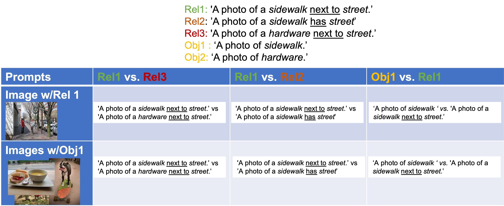
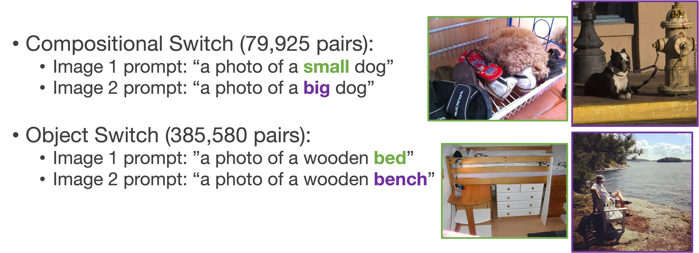
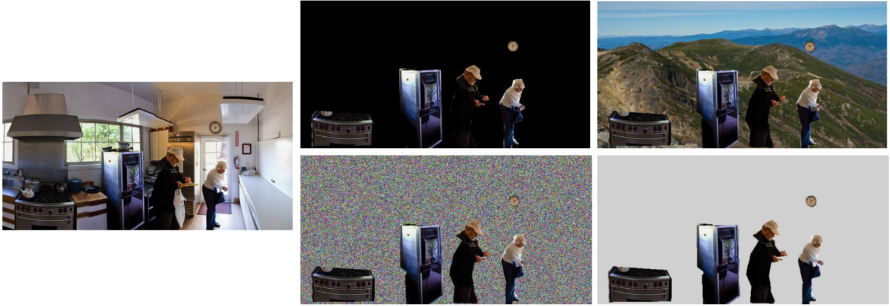
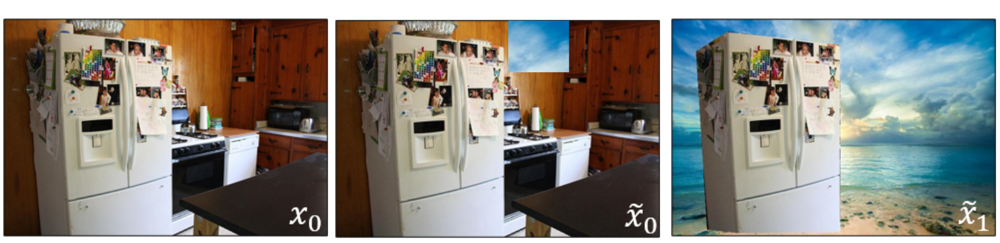
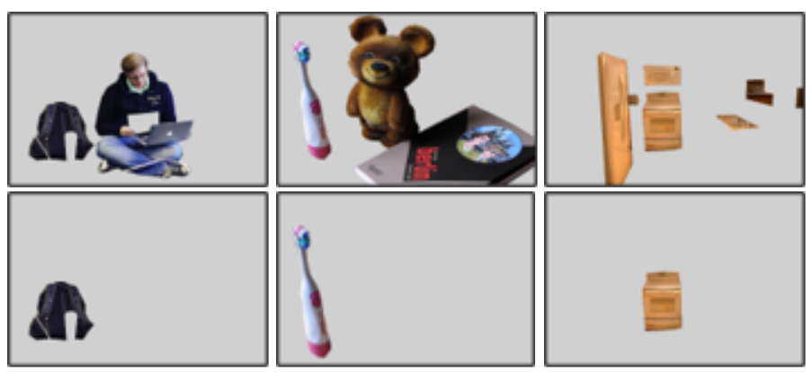

# Dataset for: Probing Conceptual Understanding of Large Visual-Language Models
These datasets are designed to be an easy-to-moderate task for visual-language contrastive models to measure how well
these models "understand". The idea is we want to know if models are using hacks or memorization as opposed to learned
understanding of object-object relations, contextual relations to objects, object co-occurrences, and attribute-object 
relations. 

There are three types of datasets: context, composition, and relations.

These datasets rely on [Visual Genome](http://visualgenome.org/api/v0/api_home.html) and [COCO validation 2014](https://cocodataset.org/#home).
In order to use these annotations, downloading the original images is required. For COCO, `Val2014` is the only required while 
for Visual Genome the entire dataset. 

## Download
This dataset can be downloaded from [here](https://www.crcv.ucf.edu/data1/probe_rcb/).

## Relational Dataset
This dataset is built off of [Visual Genome](http://visualgenome.org/api/v0/api_home.html). 
For each image, the ground truth relation is compared to a highly unlikely swap of subject and predicate. 
There are set of "positive" images that are images with the subject being swapped and no other objects from the original 
image. The predicate swapped is based on the predicates that have not been found in the original dataset to be associated with the original subject and therefore are highly unlikely.

The dataset stored in `relation_eval_subject.json` structure is as follows: 
```json
{
  "2317469": {"positive_image_ids": [2347085,
  2347556,
  2361364,
  655,
  2411388,
  2349311,
  2385870,
  2327638,
  2405565,
  1159441],
 "negative_image_ids": [2413296,
  2368727,
  2375277,
  2319315,
  2406936,
  2344369,
  2328323,
  2417504,
  2322012,
  286008],
 "positive_prompt": "A photo of a snow covering ground.",
 "negative_prompt": "A photo of a cracker covering ground.",
 "negative_object": "cracker",
 "positive_object": "snow",
 "negative_predicate_prompt": "A photo of a snow flying in front of ground."},
  "2370468": {"ositive_image_ids": [2413642,
  2388513,
  2392460,
  2415901,
  3147,
  2324924,
  2313,
  2364800,
  713878,
  713724],
 "negative_image_ids": [2378866,
  2376935,
  2393302,
  2325157,
  2370074,
  2367017,
  2346875,
  2415900,
  2380858,
  2386346],
 "positive_prompt": "A photo of a building outside window.",
 "negative_prompt": "A photo of a guard outside window.",
 "negative_object": "guard",
 "positive_object": "building",
 "negative_predicate_prompt": "A photo of a building draped in front of window."}
}
```
Note: Because there is no agreed upon split, these are selected from the entire dataset.
Dataset Facts:
* 99,960 annotations
* 6,006 objects
* 2,546 relationship aliases


### Evaluation

To evaluate on this dataset, multiple comparisons are made:
* Anchor image compared to the ground truth prompt and a prompt with the subject swapped
* Anchor image compared to the ground truth prompt and a prompt with the predicate swapped
* Anchor image compared to the ground truth prompt and a subject-only prompt (no relation)
* Mean features of the subject-only "positive" images compared to subject-only prompt (no relation) and the anchor image"s relation prompt

These comparisons are designed to tell us: 
* `Rel1 vs. Rel3`: If the model is able to recognize an object is NOT present. 
* `Rel1 vs. Rel2`: If the model has learned possible subject-object relationships and can reject non-realistic ones instead of just using object-object co-occurance.
* `Obj1 vs. Rel1`: If the model ignores relationships all-together and focuses only on object recognition

## Compositional Dataset
This dataset is built of the [COCO validation 2014](https://cocodataset.org/#home) dataset. Using the NLP library [NLTK](https://www.nltk.org/) and the COCO caption annotations, words are tagged and pairs of adjective and nouns are 
extracted. Instead of using unlikely combinations, antonyms were manually mapped to each attribute in order to ensure 
that the attribute is not present in the image. For example, if there is a "a small dog", the comparison prompt is 
"a large dog"

There are two splits for this dataset. The first is where the **composition is swapped** with an antonym and the other is 
where an **object is switched**. Each dataset has two images and two captions and comparisons are based on how well the 
model can match the captions to the correct images. 



### Split1 Compositional Switch:
* 79,925 Comparisons
* 114 Compositions
* 790 objects

```json
[{"img1_prompt": "A photo of a small dog.",
 "img1_id": "42",
 "img1_composition": "small",
 "img1_object": "dog",
 "img2_id": 371046,
 "img2_prompt": "A photo of a large dog.",
 "img2_composition": "large",
 "img2_object": "dog"},
{"img1_prompt": "A photo of a white dog.",
 "img1_id": "74",
 "img1_composition": "white",
 "img1_object": "dog",
 "img2_id": 240637,
 "img2_prompt": "A photo of a black dog.",
 "img2_composition": "black",
 "img2_object": "dog"}]
```

### Split2 Object Switch:
* 385,580 Comparisons
* 116 Compositions
* 2,475 objects

```json
[{"img1_prompt": "A photo of a small dog.",
 "img1_id": "42",
 "img1_composition": "small",
 "img1_object": "dog",
 "img2_id": 514990,
 "img2_prompt": "A photo of a small boy.",
 "img2_composition": "small",
 "img2_object": "boy"},
  {"img1_prompt": "A photo of a white dog.",
 "img1_id": "74",
 "img1_composition": "white",
 "img1_object": "dog",
 "img2_id": 437393,
 "img2_prompt": "A photo of a white horse.",
 "img2_composition": "white",
 "img2_object": "horse"}]
```
### Evaluation
To evaluate on this dataset, multiple comparisons are made:
* Each image is compared to each prompt.
* The metrics used are from the [Winoground paper](https://arxiv.org/pdf/2204.03162.pdf):
  * Text Accuracy: `Image1 + Prompt1 > Image1 + Prompt2 AND Image2 + Prompt2 > Image2 + Prompt2`
  * Image Accuracy: `Image1 + Prompt1 > Image2 + Propmt1 AND Image2 + Prompt2 > Image1 + Prompt2`
  * Group Accuracy: `Image Accuracy AND Text Accuracy`
* Also look at the mean softmax value for the correct pairs to measure model confidence
  * `(Softmax(Image1+Prompt1, Image1+Prompt2)[0] + Softmax(Image2+Prompt2, Image2+Prompt1)[0]) /2`

## Context Dataset
This dataset is built off [COCO validation 2014](https://cocodataset.org/#home) and looks at the co-occurrence between 
objects and reliance on background cues. _This dataset will be released soon._


### Split 1 Background Context:
The first set removes backgrounds and replaces them with fillings of either "gray", "black", "noise" or some 
landscape scenery from a subset of the [Kaggle Landscape dataset](https://www.kaggle.com/datasets/arnaud58/landscape-pictures/)
and [Indoor Scenes dataset](https://web.mit.edu/torralba/www/indoor.html) from this [paper](http://people.csail.mit.edu/torralba/publications/indoor.pdf).
The subset of 290 images were selected based on whether there were any objects in the image that are also in the annotations.



We additionally have an image where just one patch of the background is added to measure the change in performance
to ANY minor change.



* 31,765 Images * 3 replacement fillings
* 80 objects 

Example annotation:
```json
[{"annotations": {"bed": [{"segmentation": [[92.56,
      24.39,
      46.28,
      94.71,
      9.33]],
    "area": 179829.76725000003,
    "iscrowd": 0,
    "image_id": 133,
    "bbox": [13.99, 2.87, 626.01, 418.65],
    "category_id": 65,
    "id": 317921}],
  "teddy bear": [{"segmentation": [[536.56,
      45.99,
      538.04,
      46.21]],
    "area": 683.9160000000005,
    "iscrowd": 0,
    "image_id": 133,
    "bbox": [525.34, 20.93, 47.95, 28.72],
    "category_id": 88,
    "id": 1673328}]},
 "image": "COCO_val2014_000000000133.jpg",
 "image_id": 133},
{"annotations": {"dog": [{"segmentation": [[382.48,
      268.63,
      330.24,
      394.09,
      264.76]],
    "area": 53481.5118,
    "iscrowd": 0,
    "image_id": 42,
    "bbox": [214.15, 41.29, 348.26, 243.78],
    "category_id": 18,
    "id": 1817255}]},
 "image": "COCO_val2014_000000000042.jpg",
 "image_id": 42}]
```

### Split2 Object Co-Occurrence:
The second set is used to evaluate co-occurrence. For each image, it removes all other objects using either the segmentation
 AND the background. These are replaced with either "black", "gray", "scene" or
"noise". Images are chosen if they do not have overlapping bounding boxes and if their object area is over a threshold 
to allow for better visibility, making the task easier.

* 9,375 Images * 4 replacement fillings
* 2,259 Original COCO images modified
* 79 objects 



Example annotations:
```json
[{"image_id": 136,
 "object": "person",
 "other_objects": ["giraffe"],
 "path": "person_COCO_val2014_000000000136.jpg"},
{"image_id": 136,
 "object": "giraffe",
 "other_objects": ["person"],
 "path": "giraffe_COCO_val2014_000000000136.jpg"}
]
```

# Related Asset & Acknowledgment
Our work is relies on the open-source models built and inspired by several assets. 
We gratefully thank the authors for their open-source projects that 
allowed this benchmark to be possible:

* [COCO Dataset](https://cocodataset.org/#home)
* [Visual Genome Project](https://www.visualgenome.org/)
* [NLTK](https://www.nltk.org/)